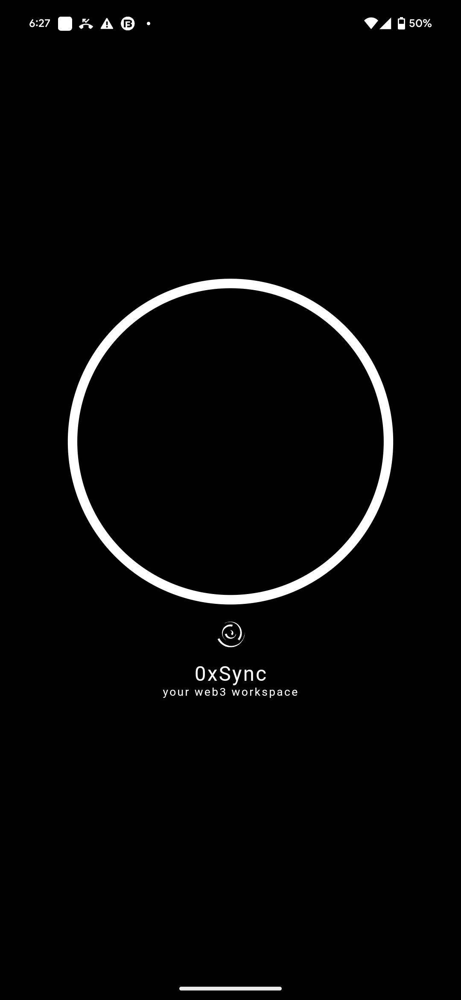
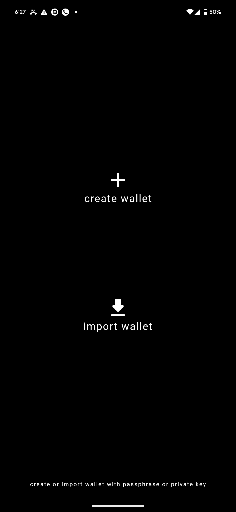
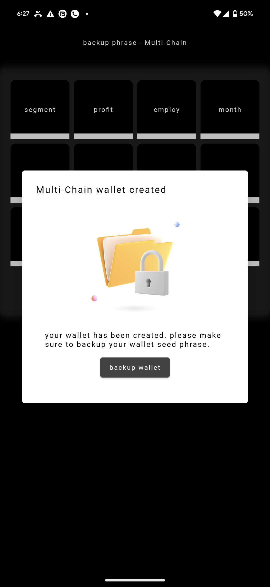
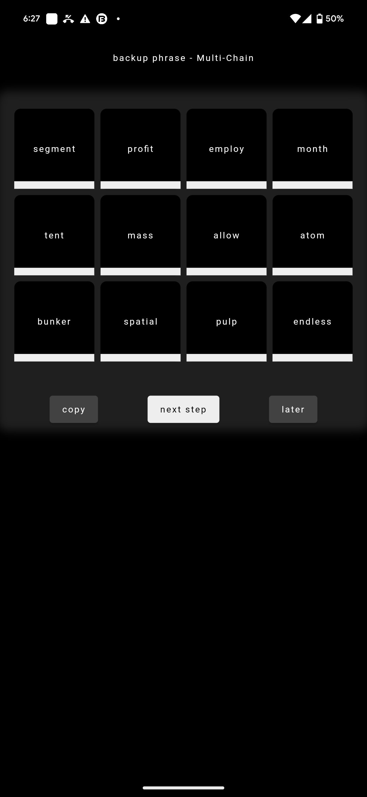
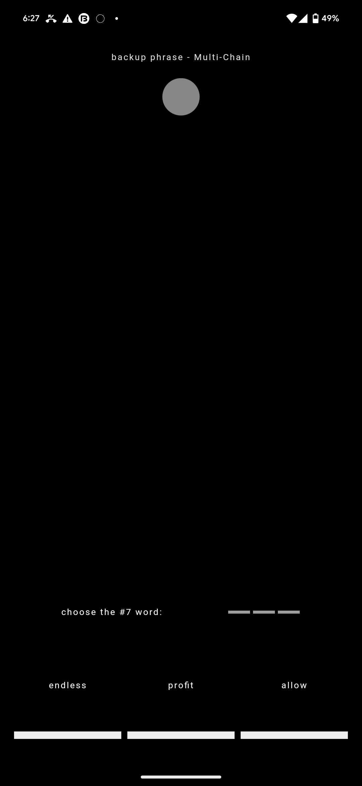
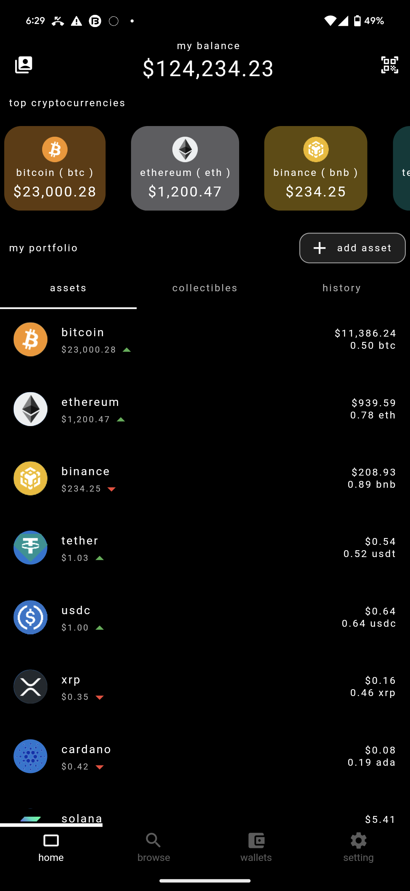
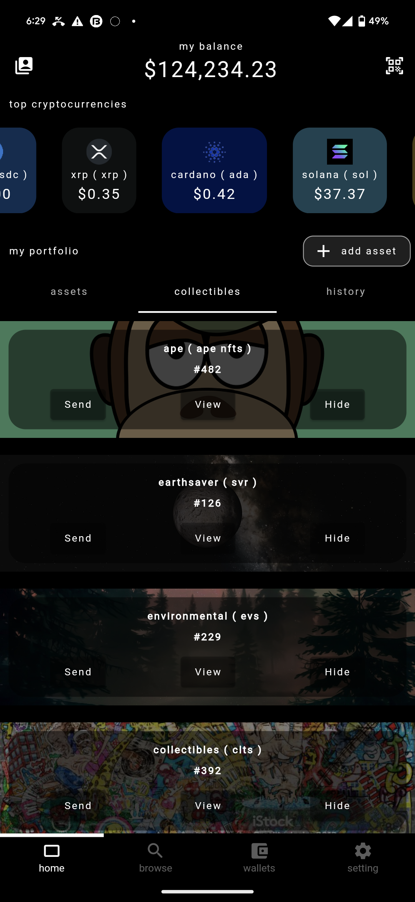
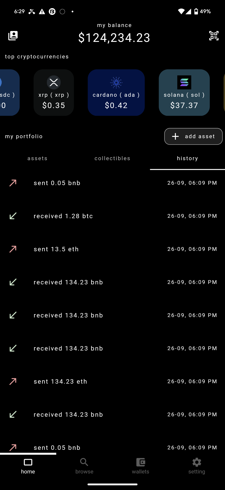
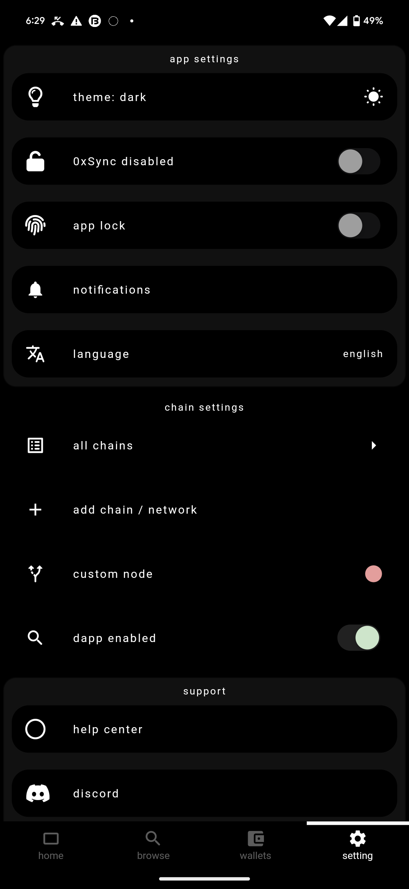
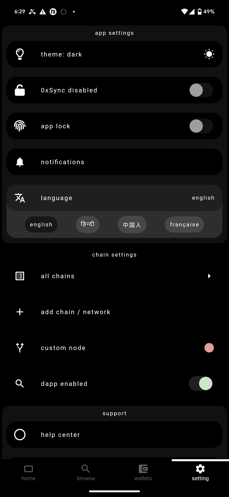

# 0xSync Core Wallet

0xsync wallet, lets users sync their web3 identity with decentralized applications anonymously and securely.

Run their own `data node` to store and authenticate dApps.

## Getting Started

install packages
```flutter pub get```

run with the device id
```flutter run -d [device-id]```

## Preview

<p float="left">
    
     
    
    
    
    
    
    
    
    
</p>
